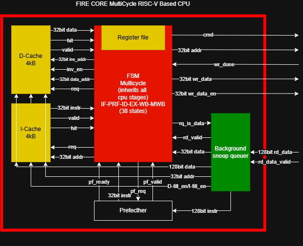
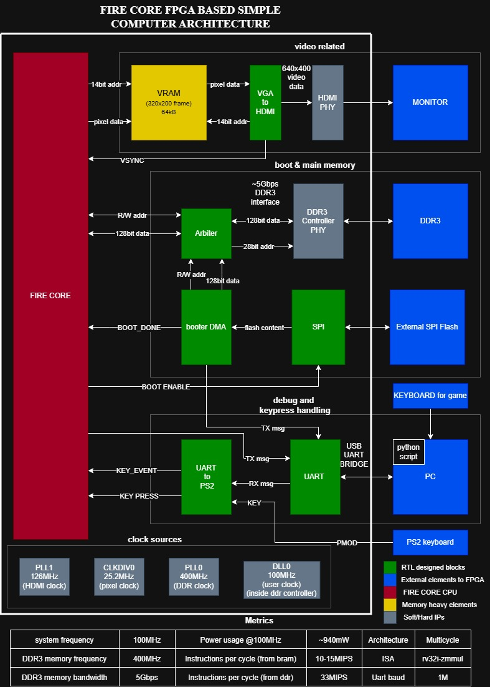
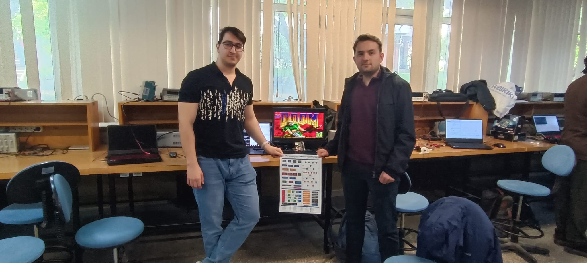

# FireCore

**We ran DOOM on an FPGA — and it actually works.**

[FireCore on GitHub](https://github.com/BekiryY/FireCore) · [Demo on YouTube](https://youtu.be/uzWZ3yWbx3k?si=STojHKZDN6oOFBLV)

---

Mustafa Ten and I built a custom RISC-V CPU on a **Gowin Tang Primer 20K** — one of the most beginner-friendly (and resource-constrained) FPGA boards out there. The CPU runs at **100 MHz** and is powerful enough to boot and run the original **DOOM**.

The heart of the project is **Fire-V**, a multi-cycle **RV32IM** CPU written in **Verilog**. Multi-cycle means each instruction takes a variable number of clock cycles to complete — fetch, decode, register access, execute, memory, writeback — all orchestrated by a **38-state FSM**. It is not pipelined and not superscalar, but it is entirely ours and it runs real software.

Built on top of Gowin’s DDR3 and DVI IP cores, the full system includes:

- **DMA bootloader** — streams the DOOM binary from SPI flash into DDR3 at startup.
- **DDR3 memory control** with a background prefetcher and a snoop queue that routes incoming memory bursts to the right place.
- **L1 instruction and data caches** (4 KB each, direct-mapped), cutting DDR3 miss penalties from ~30 cycles down to 2.
- **HDMI output**, **PS/2 + UART** keyboard support, **memory-mapped I/O**, and a **hardware crash dump** over UART.

**Result:** DOOM runs at roughly **1.2 FPS**. Not fast — but every pixel on that screen passed through logic we designed.

---

## Gallery

### Core architecture (Fire-V)

### System overview

### On hardware

---

## Why we built this

This project changed how we think about computers. If you have ever wondered what happens between power-on and your first line of code running, build something like this. The boot sequence, the memory hierarchy, and the cache stopped being abstract concepts and became things we debugged at 2 a.m.

If you are a student wondering whether to take on something that feels too ambitious — **do it**.

---

## Credits

Project by **Mustafa Ten** and **[BekiryY](https://github.com/BekiryY)**.

Special thanks to **Ebubekir Taşçı** and **Salih Burak** for helping us understand the Gowin board’s SPI-to-DDR3 boot phase.

---

## License

See [LICENSE](LICENSE) (Apache-2.0).

---

`#FPGA` `#RISCV` `#ComputerArchitecture` `#Verilog` `#EmbeddedSystems` `#DOOM` `#HardwareDesign`
